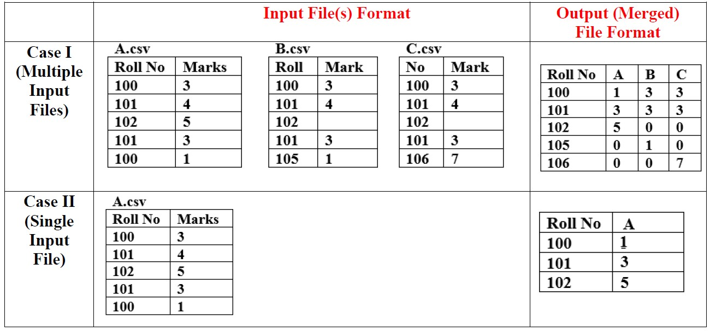

<h1><i><a href="https://merging-files-by-avinash2609.herokuapp.com/">Click to visit the webapp<i></a></h1>
  
It is an online web application to merge the CSV files 
  
<table style="width:100%">
  <tr>
    <th></th>
  </tr>
 </table>
 
<h2>Description</h2>
<ul>
  <li>Column names may be different in input files, but first column should be id/roll-num and second column should be marks.</li>
  <li>Input file(s) may contain duplicate roll numbers so considering the last entry only. e.g. In Case I, the file A.csv contain two values for roll no 100 so considering only last entry for roll no 100 i.e. 1.</li>
  <li>Putting “0” (Zero) for missing values.</li>
    <ul>
      <li>e.g. In Case I the file A.csv contain no entry for roll no 105 and 106 so putting “0” (Zero) in output file in Column “A”</li>
      <li>e.g. In Case I the file C.csv contain no entry for roll no 102 so putting “0” (Zero) in output file in Column “C”.</li>
  </ul>
  <li>In Case II, If only one input file is present, then removing duplicate entries and considering only last entry.</li>
  <li>Marks will be of numeric type (Except for missing value). For the non-numeric value of marks, making the entry of File Name, Roll No and Marks in the log file.
</li>
</ul>  
  

